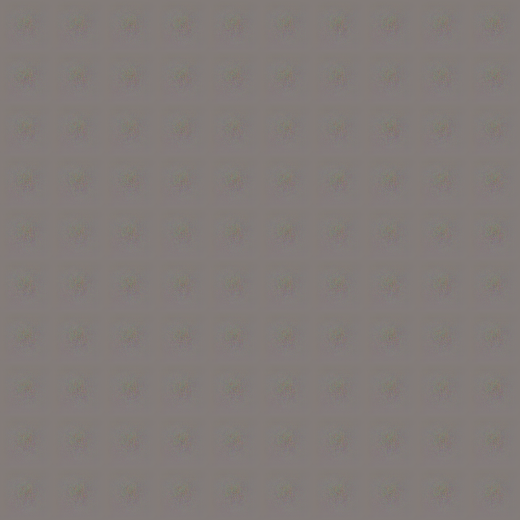

# Homework 4 - DCGAN, WGAN Network Training
## Generated Photos:

## WGAN Model Parameters
* Norm Loss Mean : 0.5314319913353813
* Norm Loss Std : 0.14724554853174154
* Real Norm Loss Mean : 0.7159148218539633
* Real Norm Loss Std : 0.10393726313096362

## DCGAN Model Parameters
* Precision : 0.0002
* Norm Loss Mean : 0.1369708615726995
* Norm Loss Std : 0.287432083368839
* Real Norm Loss Mean : 0.9936297872340427
* Real Norm Loss Std : 0.026981539218112492